[TOC]

## CNN的正则化方法分析和特征扩增

### 1. 绪论

#### 1.1 选题的价值与意义/概述

机器学习

在数字化日趋完善的时期，我们的生产和生活以前所未有的速度和程度产生和消费数据。这背后起关键作用的是机器学习，它是一种从大量数据中学习规律的技术，显著区别于自上而下的依靠专家知识构建系统的方式。从电厂的历年的运行数据，机器学习技术可以预测出明年的用电总量和高峰低谷月份；从现有的信用卡的使用记录和持卡人的个人资料，机器学习可以分析出应该给新申请人分配多少透支额度；从所有用户在电商网站上的点击记录，机器学习技术可以个性化的为每个用户推荐他喜爱的商品，即便用户没有告诉机器他喜欢什么。机器学习为解决实际问题带来了量和质的提升。量变体现在它的自动化求解大大降低了时间成本，它将绝大部分问题的解抽象为一个参数化映射，将寻找参数的过程表示为一个优化问题，然后利用现代的计算系统快速得到结果。若以传统的方法，我们需要寻找领域专家，专家再对问题建模，这通常会花费更多的时间。质变体现在机器学习为过去不能解决的问题提供了可能，即便是文字研究专家也不能够用形式化的语言定义一个数字或字母的形状，而机器学习技术可以很容易的训练出一个能够分辨不同数字或字母的模型。

深度学习/CNN

很多人相信下一个时代的主题是智能化，它要求机器充当人的部分功能，像人那样敏捷的处理各种类型的复杂问题。在人类行为因数字化的普及而被各种形式的数据记录下来的背景下，机器学习被认为是实现智能化的各种途径中很有希望的一个。传统的机器学习算法假设处理的是结构化数据，即定义良好、意义明确的特征向量。在和智能化相关的任务中，数据通常是非结构化的，比如文字、语音和图像。这给传统机器学习算法带来了挑战，它要求我们使用基于领域知识的特征工程将数据转换为结构化的，这只能在一定程度上解决问题。就图像数据为例，研究人员几十年来提出了各种特征提取方法，代表性的SIFT算子能够捕捉到图像局部的具有旋转和尺度不变性的特征点，然而这样的底层特征不足以满足智能化任务中的高层信息需求。深度学习技术扩展了机器学习的适用范围，它尝试构建一个端到端的学习系统，完成原始数据到结构化数据再到目标变量的映射。

正则化

#### 1.2 文献评论/历史和现状

经典的正则化方法

weight decay

dropout

batch-norm

数据扩增

#### 1.3 本文思路、资料和方法、各章节的主要内容及逻辑安排等

以此彰显此项研究与已有成果之差异，强调此项研究在资料、方法上的独特性，以及全文写作的基本思路，以便读者更好地把握全文，并激起阅读的兴趣

### 2. 背景知识

#### 2.1 神经网络

神经网络最初的称呼是人工神经网络（Artificial Neural Network），因为当时的研究人员是出于模拟人类大脑的目的而开发出这种模型。先驱性的工作包括MP神经元和感知机（Perceptron）。1943年，McCullogh和Pitts在一篇名为“A logic calculus of the ideas immanent in nervous activity”的论文中，给出了一个高度精简的神经元模型，我们称之为MP神经元。它的主要工作流程是：接收多个信号输入w；计算加权和s=wx；如果s大于预设阈值theta，输出一个正信号，否则，什么都不输出（也可以认为是输出0）。通过选取恰当的接收权值w，我们可以使得神经元的输入输出关系和某些函数一致，比如逻辑或（OR）和逻辑与（AND）。MP神经元的出现非常鼓舞人心，似乎我们成功踏出了探索人脑的第一步，但是它不具备人脑那样的自动学习功能，因为权值w是需要预先计算好的，所以MP神经元实质上和一个数字逻辑电路没有区别。它的主要贡献是，首次提出了神经元这种基本的计算模型。基于该模型，Rosenblatt在1958年提出了一种具备学习功能的算法，其基本计算模型和MP神经元没有区别，不过是额外提出了一种自动求解权重的方法，合称为感知机。从机器学习的角度看，感知机得到的其实是一个线性二分类器，假设数据集是线性可分的，学习算法保证了一定可以在有限次更新后找到一个将两类完美分开的超平面。从下图可以看出，OR和AND运算都可以用感知机模拟，但是XOR就不行了。

##### 2.1.1 前馈神经网络

感知机计算出的是一个在输入空间的线性分类函数，但在实际应用中，分界线几乎不可能是线性的。不过，在其他空间中，这些点可能存在线性分界线。这提示我们添加额外的转换过程。下图展示了如何通过不断的折叠，使得非线性分界线越来越接近线性。折叠操作可以通过绝对值函数实现，折叠的轴线通过一个感知机定义。

这样的充当转换功能的层被称为隐含层，因为它对应的数据即不是输入也不是输出。前馈神经网络包含至少一个隐含层，更一般的定义是多个神经预元节点连接形成的一个有向无环图，但是通常这些节点会被组织为一层一层的，整个模型是一个简单、统一的层叠式网络，如图所示。典型的前馈神经网络是全连接的，每个节点会和前后相邻的两层的所有节点相连，但是层内的节点没有连接。隐含层的层数和每层节点数是可以自由配置的，网络的拟合能力是和这两个量正相关的。找到一个好的配置并不容易，太多节点会导致网络过于完美的拟合训练集，太少节点的网络不足以表达数据的分布。包含一个隐含层的前馈神经网络具备全局近似能力，1989年Horniket等人证明了使用足够多的隐含层节点，网络可以以任意精度逼近任意一个函数。这告诉我们神经网络模型可以用于解决任何映射学习问题，但是这个理论在实际应用中并没有什么指导价值，因为它只给出了一个非常大的上限，而且没有给出下限。对于一个具体的任务，我们仍然无法知道多少个节点数量是合适的。

前馈神经网络可以被看成一个通用的回归或分类模型。和其他机器学习模型的求解方法一样，我们需要先定义一个损失函数，该函数的值代表了网络目前的行为和数据集的接近程度。训练的过程是调整网络的连接权值，使得损失函数在训练集上的均值尽量小。使用最广泛的优化方法是梯度下降法，该算法收敛到全局最优的条件是优化对象是一个凸函数。尽管多层神经网络的损失函数不具备这样的性质，但在实际使用中，梯度下降法几乎总能得到不错的结果。这一点可能和高维度的特性相关。

#### 2.2 卷积神经网络

相同：卷积神经网络和前馈神经网络非常相似，都是由一些包含可学习的权值的神经元构成。每个神经元从前一层接收输入，执行点积运算，然后通过一个非线性激活函数转换特征空间。整个网络仍然表达了一个函数，自变量是图像像素，因变量是某种高层信息的分数，比如图像属于某些类别的概率。

不同：不过，卷积神经网络是专为图像数据设计的，其层与层的连接方式有变化，训练方式也有一定变动。前馈神经网络的每个神经元的输入包括了前一层的所有单元，这种连接方式并不适用于图像数据。虽然图像有确切的尺寸，维度是固定的，但它并不是严格意义上的结构化数据，因为某个维度表达的语义并不明确。图像的特点是局部相关，任意截取一个小块，都可以归纳出某种模式，比如图像左右两部分的颜色差异较大的是一个边界，中间和两边差异较大的是一条线段，这种可归纳性在图像的每个局部都成立。而图像整体并不具备这样的特性，因为图像生成的机制实在是太复杂了。卷积神经网络可被看成一种递归滤波。像素的简单组合是线条，线条的简单组合是纹理，而纹理的简单组合就可能是某种物体了。卷积神经网络的每一层的神经元构成一个三维结构，由宽度、高度和通道数定义。每个神经元只和前一层的某个区域的神经元相连接，同层的不同节点和前一层的连接权重是共享的，这和全连接有明显的区别。

##### 2.2.1 CNN的结构

典型的CNN由卷积层、Pooling层和全连接层组成。

卷积层由多个可学习的滤波器（filter）组成。滤波器是三维的，其长度和宽度都比较小，一般限制在10以内，通道数和输入保持一致。卷积其实是一个滑动的过程，滤波器在输入特征的横向和纵向方向上移动，每个位置上单独计算点积，得到的是一个二维的特征图。特征图的值代表了输入特征的各个局部和滤波器的相似程度。卷积层由三个主要的超参数定义：滤波器数量、滤波器尺寸和滑动步长。滤波器的数量会显著影响卷积层的表达力，因为每个滤波器学习到的都是独立的模式，更多的滤波器可以提取到更丰富的信息。比如作用于原始图像的第一层卷积层，需要捕捉不同方向的线条、不同颜色的色块等。一个卷积层通常包含了几十到几百个滤波器，每个独立产生一个二维特征图。这些特征图堆叠起来就是卷积层的输出。滤波器的尺寸也会影响卷积层的表达力和稳定性。大卷积核能够提取到复杂的模式，但是也可能捕捉到噪音；小卷积核提取的是小范围的简单模式。将多个小卷积核级联可以获得更大的视野范围，比如两层3*3的卷积核的表达力等价于一层5、5的。实验表明，降低卷积核的尺寸并增加网络的层数可以获得泛化能力更好的网络。滑动步长决定了输出的特征图是否会被降采样。可以单独设置横向和纵向的步长，不过一般两个值相等，以s表示。若s为1，那么输出特征图的尺寸几乎等于输入特征图。若s大于1，那么输出特征图缩小为原来的1/s左右。

Pooling层的作用是去除冗余信息。它把相邻的多个响应值合并为一个，因此它也降低了特征图的尺寸。通常，每一定数量的卷积层后面会被添加一个Pooling层，越到网络的高层，特征图的尺寸越低。这使得位于高层的小卷积核也获得了大的视野范围。根据合并方式的不同，可以分为Max-Pooling和Avg-Pooling，使用最广泛的是前者。另一个关键参数是窗口尺寸，一般是2，2。Pooling层中的滑动步长一般等于窗口尺寸，意味着滑动时不会出现重叠。Pooling层不是必需的，将卷积层的滑动步长设置为大于1的值同样可以降低特征图的尺寸。

CNN中的全连接层和前馈神经网络中的完全一样，此处不再赘述。有实验表明，利用最后一个卷积层输出的特征图训练一个SVM分类器，可以达到类似的识别精度。这说明CNN的卷积层部分是一个特征提取器，而最后的全连接层充当分类器。

##### 2.2.2 常见模型

LeNet是由LeCun等人在90年代开发的用于手写数字识别的网络模型，识别率达到99%以上。它的主要结构是两层5，5卷积层加上两次2，2降采样。这是卷积神经网络的第一个成功应用，它显示CNN这种简洁的模型在处理图像识别上的巨大潜力。这可能激励了人们尝试开发更大规模的CNN以处理更复杂的物体识别。

2012年ImageNet图像识别比赛的获胜模型AlexNet证明了这是可以做到的，它实现了84%的top5识别率，远远超过使用传统方法的第二名获得的74%识别率。这项工作由Alex Krizhevsky等人完成，网络结构和LeNet类似，但是层数和卷积核数量都更多，总共有5个卷积层和三次降采样。它表明了CNN在处理复杂的图像识别问题上的有效性，促成了神经网络的再次流行，许多计算机视觉研究人员自此开始研究CNN。

2014年ImageNet的获胜模型VGGNet继续大幅度提升了识别性能，top5识别率达到了93%左右。它包含了13个卷积层和5次降采样。和AlexNet的明显区别是卷积层的数量增加了一倍多，它显示了CNN的层数对模型效果的决定性作用。然而，随着层数的增加，网络的训练越来越成为问题。

2015年何凯明等人在改进了网络结构并结合了其他人的多项工作后，训练出了超过100层的网络模型，ResNet。这也是当年ImageNet的获胜模型，top5识别率提升到96%左右。ResNet中引入的隔层连接显著改善了神经网络的训练难的问题，到目前（2017年末）ResNet仍然是CNN研究和应用的首选基准模型。本文的后续实验也都基于该模型。

#### 2.3 神经网络的训练

一旦神经网络中的参数被确定，输入和输出的映射关系就确定了。不同的参数取值将导致不同质量的映射关系，随机初始化后的网络表达的映射没有任何意义，经过训练过程调整好的参数就定义了针对某个问题的解。为了判断参数的好坏，我们会定义一些指标，衡量网络输出和我们的预期的符合程度，契合度越高该类指标越低。这样的指标的计算公式被称为损失函数（loss function），函数在一组参数上的取值被称为损失值（loss）。显然，损失值越低的参数越好，神经网络的训练就是寻找在某些给定条件下的损失最小的参数。

这是一个优化问题，目前比较成熟的优化理论和工具都是建立在目标函数是凸函数的条件之上的。令$X$是一个凸集，$f: X\rightarrow R$是一个函数，满足公式1的$f$被称为凸函数，满足公式2的$f$被称为严格的凸函数，显然后者是前者的子集。凸函数的局部最值也是全局最值，严格的凸函数的只有一个局部最值。判断一个函数是否是凸函数可能是很困难的。在$X$是一维的情况下，可导函数$f$是凸函数当且仅当导数是单调非递减的，如果$f$是二阶可导的，简单判断其二阶导数是否非负即可。当$X$是多维度时，基于一阶梯度的判断方法不再可用，二阶可导的$f$是凸函数当且仅当黑塞矩阵在定义域内是半正定的。在自变量具有很高的维度时，比如深层的神经网络的参数通常是百万级的，求解黑塞矩阵可能会因成本过高而不切实际。
$$
\forall x_1, x_2 \in X, \forall t \in [0, 1]: \qquad f(tx_1+(1-t)x_2)\leq t f(x_1)+(1-t)f(x_2).
$$

$$
\forall x_1 \neq x_2 \in X, \forall t \in (0, 1): \qquad f(tx_1+(1-t)x_2) < t f(x_1)+(1-t)f(x_2).
$$

在求解最值方面，一维和多维自变量也是很不一样的。一维情况是可能存在解析解的，可导的凸函数$f$的驻点即是局部极值点，也是全局极值点，所以只需令梯度表达式等于零然后解一个一元方程即可。也可以采取迭代式方法求解数值解，比如梯度下降法可以收敛至驻点。高维的情况则要复杂很多，解析解不存在，而数值方法求解的驻点可能是局部极值点，也可能是鞍点。鞍点和极值点的共同点是梯度为0，区别点是前者的黑塞矩阵的特征值有正有负而后者的特征值非负。驻点附近正特征值的特征向量方向上函数值更大，负特征值的方向上函数值更小，所以鞍点既不是极小值也不是极大值。高维函数上的鞍点的数量远远多于极值点。假设黑塞矩阵的特征值大于0和小于0的概率均等于$1/2$，那么这样一个驻点是极值点的概率为$0.5^{d}$，是鞍点的概率为$1-0.5^{d}$，$d$是自变量的维度。当$d$是较大的值时，$0.5^{d}$是极小的值，$1-0.5^{d}$会非常接近$1$。然而，实验表明鞍点不会为神经网络的训练带来困难，梯度下降法几乎总是可以收敛至很低的值。

##### 2.3.1 损失函数

损失值是一种衡量模型的实际输出和期望输出的差异程度的指标，该值越小差异度越小。对于回归和分类问题，损失值的定义也很不一样。回归问题的求解目标是输出尽量靠近真实值，是正向还是负向接近没有影响，一个自然的选择是绝对值误差。由于绝对值不是处处可导的，所以常常用是平方误差替代，它的求导非常方便并且同样不受差值的符号的影响。用于优化的目标函数应当是求在自变量分布上的期望值，实际计算时可用样本的均值近似，其定义如公式所示。
$$
MSE=\frac{1}{n} \sum_{i=1}^n{(y_i-f(x_i))^2}
$$
对于分类问题，模型的输出是样本在各个类别上的概率，所有的概率的和为1，所以可以将其看成一个离散分布。真实标签经过$one-hot$编码后可以类似的看成一个分布。所以分类问题需要一个能衡量两个分布的相似性的指标。统计学中的f-散度就是这样的一类指标，它们具有非负性、单调性和联合凸性的性质[维基百科]。f-散度的一种特例KL散度是基于神经网络的分类模型的标准误差函数，其定义如下面的公式。
$$
D_{KL}(Data||Model)=\frac{1}{N} \sum_{i=1}^N \sum_{j=1}^c{y_{ij}\log {\frac {1}p_{ij}}}
$$
其中$N$是数据样本的数量，$c$是类别数量，$y_{ij}$是第$i$个样本在第$j$类上的真实概率，$p_{ij}$是模型输出的概率。概率倒数取对数数后的曲线如图所示，当真实类别的概率接近1时，损失值也接近0；当真实类别的概率逐渐减小时，损失值上升的比率也越来越大。这激进的惩罚了模型以较大的概率输出错误类别的情况，可以加速训练初期时损失值的下降。KL散度在信息学中被称为信息增益，$KL(P||Q)$表示使用针对Q分布的最优编码方式编码符合P分布的信号所需要的额外比特量，当Q等于P时，使用的编码方式即是针对P分布的最优编码，额外比特量为0。然而，由于不可考证的原因，出现在神经网络文献中的频率更高的损失函数叫交叉熵（cross entropy）。它的定义如公式，其应用到神经网络的训练时，等价于KL散度，因为$H(P)$是一个常量。
$$
H(P,Q)=H(P)+D_{KL}(p||q)
$$

##### 2.3.2 梯度下降法

梯度下降法的基本假设是函数是局部近似线性的，可以用泰勒一阶展开近似表示。设$y=f(x)$是一个一元函数，对于非常小的$\epsilon$，有
$$
f(x+\epsilon) \approx f(x) + \epsilon f'(x)
$$
上式说明了当自变量发生小的变动时，函数值会如何变化，导数$f'(x)$其实是$f(x)$在$x$处的斜率。如果要使得函数值变小，即$\epsilon f'(x)<0$，只要使得自变量的偏移和导数的符号相反即可。实际应用中的目标函数通常是非线性的，为了不打破基本假设，更新量$\epsilon$必须很小，通常是小于1的浮点数。这就是Cauchy于1847年提出的梯度下降法。神经网络的参数多至数百万，所以优化函数的自变量是一个向量。对于这样的函数，有
$$
f(\mathbf{x}+\mathbf{u}) \approx f(\mathbf{x}) + \mathbf{u}^T \nabla_\mathbf{x} {y}
$$
其中$\nabla_\mathbf{x} {y}$是$y$在$\mathbf x$上的梯度，是一个长度为1的列向量。偏移量$\mathbf u$不再只有正负两个方向的选择，而是可以向任意方向。为了推导出最优的移动方向，我们设$\mathbf u$是单位向量，即$\mathbf u^T \mathbf u=1$。
$$
\min_{\mathbf u}  \mathbf{u}^T \nabla_\mathbf{x} {y}
=\min_{\mathbf u} ||\mathbf u|| *  ||\nabla_\mathbf{x} {y}|| \cos {\theta}
=\min_{\mathbf u} \cos \theta
$$
其中$\theta$是偏移量和梯度的夹角。显然，$\theta=180^0$的$\mathbf u$是上式的解，即当自变量朝着梯度相反的反向偏移时函数值下降得最快。所以定义在多远函数上的梯度下降法的迭代公式是
$$
\mathbf x' = \mathbf x - \epsilon \nabla_\mathbf{x} {y}
$$
$\epsilon$被称为学习率，它决定了一次更新的长度，太小的值会使得下降过于缓慢，太大的值可能造成无法下降。该值的选取跟函数局部的曲率有关，当曲率较大时梯度变化较快，需使用小学习率；当曲率较小时线性度高，可以使用稍大的学习率加快下降速度。一些基于二阶梯度的优化方法就是利用了这样的基本原理，但是对于神经网络模型来说，求解黑塞矩阵的成本过于昂贵，所以牛顿方法等不会被用在神经网络训练。学习率的选取更多依靠经验和直觉，通过多次尝试的方法选择一个可行的较大的学习率，随着训练进行逐渐减小学习率。

##### 2.3.1 参数初始化

梯度下降法是从一个初始点开始迭代下降的，初始点的选取对算法的影响可能很大也可能很小，和目标函数的形状有关。当目标函数是凸函数时，从任意初始点开始算法都可以收敛至全局最优；当目标函数是非凸函数时，不同的初始点可能收敛于不同的驻点。深层神经网络一般属于第二种情况，初始点可以决定收敛的速度和收敛值，甚至可以影响网络是否可以训练。目前已经有一些被实验证明了有效性的初始化策略，它们都主要考虑参数的两个性质：分布和数量级。

同一层节点的参数应该避免被初始化为相同的值，否则之后他们的每次更新都会保持一致，最终收敛至相同的参数而表达相同的函数，这样模型的容量会因为大量冗余节点而下降。理想情况下，不同的节点应该捕捉到不同的模式。打破冗余的一个简单策略是使用随机分布的抽样来初始化参数。分布类型的选取来自于经验，人们观察到训练好的神经网络的参数基本都符合高斯分布，因此也把它用在初始化，这可以被认为某种意义上的让初始点更靠近收敛点。实验表明均匀分布一般也是有效的，选择哪种分布不是十分重要。

分布的超参数决定了初始值的数量级，比如高斯分布的方差和均匀分布的上下边界，这对网络的训练非常关键。神经网络的表达式是一个嵌套的函数，根据链式求导法则，内层参数的偏导数由一系列的量相乘而得。乘式的因子数量基本等于网络的层数，对于很深的网络而言，乘积会很不稳定。如果都是小于0的量，那么乘积会不断变小甚至接近0；如果都是大于0的量，乘积会越来越大甚至超过整数的表示范围。所以，初始化时要选择合适的参数量级以避免这两种情况的发生。Glorot等人在使用了一系列强假设的前提下推导出了前向神经网络的激活值和梯度随层数的变化规律，在此基础上提出了参数的理想量级$Var(W_i)=\frac {2}{n_{in} + n_{out}}$，其中$n_{in}$是前一层的节点数量，$n_{j+1}$是后一层的节点数量。应用到高斯分布和均匀分布后，初始化公式如（7）和（8）。
$$
W \sim N\Big(0, \frac{2}{n_{in}+n_{out}} \Big)
$$

$$
W \sim U \Big(  -\frac{\sqrt 6}{\sqrt {n_j+n_{j+1}}} ,\frac{\sqrt 6}{\sqrt {n_j+n_{j+1}}} \Big)
$$

##### 2.3.3 基于后向传播的梯度计算

梯度下降法的基本思路是求出目标函数对自变量（参数）的梯度，然后向梯度的反方向更新权值。后向传播（Back-Propogation，简称BP）算法是一种高效的梯度计算方法，由Werbos在19xx年首次提出，后来Hinton等人再次独立提出。之所以出现同一个研究成果被多次提出，是因为当年正处于“AI寒冬”，神经网络会议稀少，研究人员之间缺乏交流。这种算法的基本思想是利用后一层节点的梯度计算当前层的权值的梯度，这样计算整个网络的参数的梯度的复杂度是$O(N+M)$，N是节点数量，M是连接数量。BP算法在神经网络领域享有很高的荣誉，很多人认为它的出现使得多层神经网络的训练才得以解决，然而笔者认为它不过是复合函数求导中的级联法则的一个简单应用。完全抛开BP算法，我们照样可以求出参数的梯度，只是效率会低一些。它解决的只是训练得快不快的问题，而不是能不能训练的问题。因此，可以认为BP算法被严重过誉了。目前，神经网络的可训练性仍旧是一个开放的问题。

#### 2.4 模型容量与泛化能力

##### 2.4.1 模型容量

模型的容量代表了它能够拟合的函数的复杂度。考虑单变量的线性回归，如果只使用原始特征，$y=wx+b$表达的是一条直线；如果将特征的平方也作为自变量，$y=w_1x+w_2x^2+b$表达的是一条抛物线；继续添加$x$的高次方作为特征，当$d$足够大时$y=b+\sum\limits_{i=1}^d{w_ix^i}$可以拟合任意形状的曲线。神经网络的容量也遵循类似的规律，层数越多、每层的节点越多，其容量也越大。节点连接方式、激活函数和浮点数精度等也可以影响模型容量。容量不够的模型不足以表达问题的解，无论怎么优化训练误差也不能达到接近0的值，这种情况被称为欠拟合。足够大的容量的模型不会存在优化的难题，但是有过拟合的风险。模型的容量是一个不能被量化的性质，因此寻找和任务复杂度恰好匹配的模型是不切实际的。在实践中被选择的模型的容量通常都是远远大于问题的复杂度的。

##### 2.4.2 泛化性

模型训练是在一个预先收集的数据集上进行的，我们称之为训练集。优化方法能够保证的是，训练好的模型在这个数据集上具备很好的表现，即具备低的训练误差，而模型的真正价值体现于它在实际场景中的数据上的误差期望，即泛化误差。由于真实数据的分布是未知的，我们通常从收集到的数据中中划分出一部分，称之为测试集。测试集不参与训练，只是用来近似计算模型的泛化误差。训练误差和泛化误差之间几乎总是存在间隔。一方面，神经网络等机器学习方法的基本假设是训练集和测试集的分布是一致的，所有样本都从该分布独立抽样，但这并不完全成立。图像数据的生成过程过于复杂，数据集只能捕捉到部门因素的部分取值。比如光照，训练数据集包含了某组取值，而实际场景中它可以是$[0,255]$区间的任意值。样本的独立性也可能失效，设想采集某个人的人脸图像的场景，如果采取连续拍摄，那么这些图像之间是有很高的相关度的，可能表情、角度会非常接近。我们在收集数据时需考虑到这些问题，尽量使得其满足独立同分布的特性。另一方面，泛化性和模型本身的性质有关。大容量的模型倾向于过拟合，泛化性能差。而深层的神经网络具有很大的容量，其参数数量可能比数据量还多，Chiyuan Zhang等人的实验表明神经网络能够拟合随机打乱类别信息的数据集，这意味着在不改变模型和超参数的情况下模型的泛化性能也可以显著变差。这违背了统计机器学习中关于泛化性的VC维、Rademacher复杂度等理论。神经网络是否就是一组最近邻分类器，而不是真的学习到了数据的分布？这需要更多的研究。

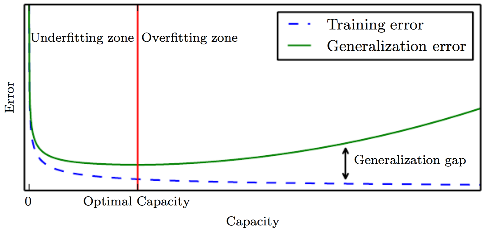

##### 2.4.3 正则化

正则化方法一类以提升机器学习算法的泛化指标为目的的方法。在大多数机器学习算法中，正则化就是在目标函数中加入额外的项，但是在深度学习中正则化可以有更灵活的形式。它们可以被分为显示和隐式正则化。正则化一词的原意是对模型增加的某种约束，这种约束一方面表达了某种增加泛化性的先验知识，另一方面也会减小模型的有效容量。前者可能可以减小泛化间隔，后者可能会增加训练误差。一个有用的正则化方法降低的泛化间隔必须大于增加的训练误差，因为这样泛化误差才会被降低。基于约束模型容量的思路而提出的正则化方法被称为显示的，其他不增加模型容量和不使用额外数据的能提升泛化指标的正则化方法统称为隐式的。另一种分类方法是按照它产生作用的地方。机器学习算法有三大基本成分：数据、模型和优化方法。所有的正则化方法都是对其中一项或多项的改动。在数据上的改动被称为数据扩增，利用已有数据生成新数据，其依据是统计机器学习理论中的额外的数据获得额外的泛化性。它可以是扩增自变量，比如线性插值、图像变换；它也可以是扩增因变量，比如标签平滑、标签扰动。在模型上的改动有两种：一是对模型结构的改动，比如Dropout和Batch-Norm；二是对目标函数的改动，比如参数衰减。在优化方法上的改动通常是修改了梯度的计算方法，比如随机梯度下降、含高斯噪声的梯度等。这些正则化方法单独使用也可以混合使用，一般来说额外使用不同工作原理的正则化方法可以得到额外的泛化性增长，但遗憾的是正则化方法的工作原理并不明确。已有实验表明某些正则化方法会比较“强势”，当它存在时其他正则化方法就失效了。比如足够丰富的数据扩增方法会使得显示的参数衰减没有显著作用，这说明看上去原理不同的正则化方法其实是会相互影响的，或者我们对这些正则化方法的理解是完全错误的。

#### 2.5 稳定性

1-norm

sharpness

#### 2.6 图像分类问题

图像分类是给一副图像分配一个或多个标签，指出图像描绘了什么场景、包含了什么物体等。只有进行了这样的转换，计算机才可以一定程度上理解图像，否则它只是一个没有任何语义信息的矩阵。图像分类是计算机视觉的核心问题，因为计算机视觉领域的大多数其他问题都可以被分解为分类问题，比如物体识别是在图像的多个位置进行分类，图像分割是在像素级别上分类。然而，这个基础问题又非常困难。图像的生成过程受很多因素影响，可以将其分为环境条件和自身变化两类。前者包括光照、拍摄角度和遮挡，后者的情况更加复杂，以人脸为例，个体的发型、饰物和表情变化都将显著改变图像矩阵的取值。这些因素的自由度都太大，对其正向建模几乎不可能。因此，以数据驱动位思想的机器学习方法更合适。卷积神经网络就是为分析图像而设计的一种机器学习模型，近些年成为图像分类的标准方法。本文也以在图像分类问题上的效果来衡量正则化方法对CNN的有效性。

##### 2.6.1 数据集

MNIST

Fashion-MNIST

CIFAR-10是一个很流行的图像分类测试数据集。它包含的是3通道的32，32尺寸的图像，类别包含了猫、狗等动物和轿车、轮船等交通工具共十个。图像总量是6万张，被划分为5万和1万的两个子集，一般分别被当做训练集和测试集。另有CIFAR-100数据集，包含的图像和CIFAR-10完全一致，不过类别的粒度更细，比如人被分为了婴儿、男孩和女孩等，总计有100个类别。

ImageNet

##### 2.6.2 特征提取

##### 2.6.3 分类器

### 3. 常用正则化方法分析

训练神经网络时，我们是根据损失函数在训练集上的取值来调整参数的，这可以确保模型在训练集上取得好的效果，但是模型的价值是在测试集上体现的。神经网络作为一种通用的函数拟合手段，其被应用在特定问题时过拟合很容易发生。正则化就是通过设计一些策略，降低模型在测试集上的错误率（这可能会带来训练集误差的上升）。目前有很多针对卷积神经网络设计的正则化方法，可以归结到三类：作用于模型上的、作用于训练方法上的和作用于数据上的。作用于模型上的正则化方法是在网络结构上增加额外的层，训练和测试时这些层都和正常的节点层一样参与计算，代表性的有Dropout和Batch-Normalization；作用于训练方法上的正则化方法一般是修改梯度求解公式，比如在目标函数上添加一个额外项，它们只是训练时发挥作用，代表性方法有SGD和参数衰减；作用于数据上的正则化方法是修改数据集或标签，比如数据扩增和标签平滑。

#### 3.1 参数衰减

##### 3.1.1 简介

最常见的显示正则化方法是在损失函数 $J(w)$上添加权值的范式$O(w)$，我们用$J'(w)$来表示正则化后的损失函数$J'$
$$
J'(\theta) = J(\theta) + \lambda*O(\theta)
$$
$O(\theta)$和$\theta$的绝对值正相关，将其添加到损失函数，可以使得训练时同时降低原始损失函数和参数的范式。它限制了参数的变动空间，促使其向更小的绝对值、更多的零取值靠拢，从而限制了网络表示的函数的复杂度。 $\lambda$是一个超参数，该值越大，正则化的作用越明显，不过太大的$\lambda$值会干扰原始损失函数的下降。在实验中，可以根据$J(t)$和$O(t)$的数量级，选择适当的$\lambda$使得$\lambda*O(t)$的数量级和$J(t)$相当或者略小。$O(t)$仅定义在网络的连接权重上，而不包括偏置项，因为后者只充当常数项，不影响网络的复杂度。另外从训练时对数据的需求来看，连接权重更容易和过拟合相关，因为它影响的是两个节点的交互，需要观察到两个节点的各种取值的组合，而偏置只控制一个单一的节点。下文中，我们用$w$表示和正则相关的参数，$t$表示所有参数（包含$w$）。

以上是定性的分析，下面定量的分析$l2$正则是如何影响权值的更新方式和收敛的极值点的。$l2$正则又称为岭回归、Tikhonov正则，它通过添加$O(t) = \left\|w\right\|_{2}$到损失函数来实现。为了简化公式，且在不影响分析的前提下，我们假设没有偏置项，那么$\theta$就是$w$，那么

$$
J'(w) = \frac{1}{2} \lambda*\left\|w\right\|_{2} + J(w)
$$
其在$w$上的梯度是

$$
\nabla _w J = \lambda w + \nabla _w J
$$
按梯度下降法的更新公式，一次迭代是
$$
w = w - \epsilon (\lambda w + \nabla _w J) = (1-\epsilon \lambda)w - \epsilon \nabla _w J
$$
可以看到添加的正则项改变了梯度规则，其相当于每次先缩小w，再执行和原来一样的更新。这是单次更新的情况，我们需要知道正则项对w最后的收敛值有什么影响。梯度下降法的收敛于梯度为0的地方，即驻点。令$w^*=arg min J(w)$为没有正则化的收敛点，我们用二阶泰勒展开式近似$J(w)$在$w^*$附近的取值。
$$
J(w) = J(w^{*}) + 1/2(w-w^{*})^{T}H(w-w^{*})
$$
其中，$H$是$J$在$w^*$处的黑塞矩阵。根据驻点的定义，可以得到
$$
H(w-w^{*}) = 0
$$
设$w1$为有$l2$正则项的损失函数的驻点，有
$$
H(w-w1) + a*w = 0 => w1 = {(H + aI)}^{-1}Hw^{*}
$$

因为黑塞矩阵H是实对称的，可以被分解为$H=Q\Lambda Q^T$，$Q$是正交矩阵。应用到上面的式子，有
$$
w1=Q(\Lambda  + \alpha I)^{-1}Q^T w^*
$$
可以看出$l2$正则使得$w^*$按照$H$的特征向量定义的方向缩放，各个方向缩放的比例是$s=\frac {\lambda _i}{\lambda _i + \alpha}$。当$\lambda _i$靠近0时，$s$取得很小的值，对应的权重$w_i$会显著变小；当$\lambda _i$比较大时，s接近1，对应的权重$w _i$基本保持不变。而特征值代表了对应方向上的特征对目标函数的影响能力，l2正则进一步使得不重要的特征的权值减小，而重要的特征的权值得以保留。另外一种通用的权值衰减项是$l1$正则，它把$\Omega(\theta)= \left\|w\right\|_1$加到损失函数上。通过和上面类似的推导步骤可以知道，$l1$范式可以使得某些连接权重为0，这和稀疏编码的思想有些相似。下图形象地展示了$l1$和$l2$正则是如何改变损失函数的极值点的。

##### 2.3.2 实验

参数衰减方法的超参数$\lambda$控制了正则化的程度。为了更仔细的观察该参数对训练过程和结果的影响，我们设计了一组对照实验。该实验基于一个简单的CNN网络和$CIFAR-10$数据集进行。没有选择更常用的$MNIST$数据集是因为该数据集定义的手写数字识别任务过于简单，几层的卷积网络就可以达到超过$99\%$的识别率，不能代表实际应用中的图像分类问题，而$CIFAR-10$中的类别更加抽象，目前文献中可以查到的最高识别率在$95\%$左右。网络由两层卷积层和两层全连接层组成，每次卷积之后会通过pooling层降低特征图的尺寸，在本文中我们称之为$CIFAR-Net$。具体结构如下表。

| 层    | 1                  | 2          | 3                  | 4          | 5    | 6    |
| ---- | ------------------ | ---------- | ------------------ | ---------- | ---- | ---- |
| 类别   | conv               | pool       | conv               | pool       | full | full |
| 参数   | $5\times5\times64$ | $2\times2$ | $5\times5\times64$ | $2\times2$ | 384  | 10   |

为了排除其他正则化方法的干扰，该网络不包含Batch-Norm和Dropout这样的结构。虽然其识别率不能达到目前最好，但就本组实验的观察对象而言不是一个问题，并且计算成本较低。关于数据预处理，我们仅使用了标准化，而没有任何数据扩增的操作。为了获得更加稳定的梯度估计，我们使用了较大的Batch-Size，256。前述几项实验设置均是为了排除其他具有正则化效果的因素，使得网络训练只受到衰减权重$\lambda​$的影响。实验参数在下面的表格中列出。

| 参数名        | 取值                                      | 备注         |
| ---------- | --------------------------------------- | ---------- |
| 模型         | Cifar-Net                               |            |
| 数据         | CIFAR-10                                |            |
| 优化方法       | SGD                                     |            |
| Batch-Size | 512                                     |            |
| Momemtum   | 0.9                                     |            |
| 迭代次数       | 100K                                    |            |
| 学习率        | $0.01*0.91^{\lfloor step/2000 \rfloor}$ | step是已迭代次数 |
| 参数衰减权重(wd) | [0.1, 0.01, 0.001, 0.0001, 0.00001]     |            |

初始学习率是$0.01$，并在训练过程中指数衰减，每隔2000次迭代学习率会被降低$9\%$。整个训练过程的十万次迭代结束时，学习率接近$1e-4$。

##### 2.3.3 分析

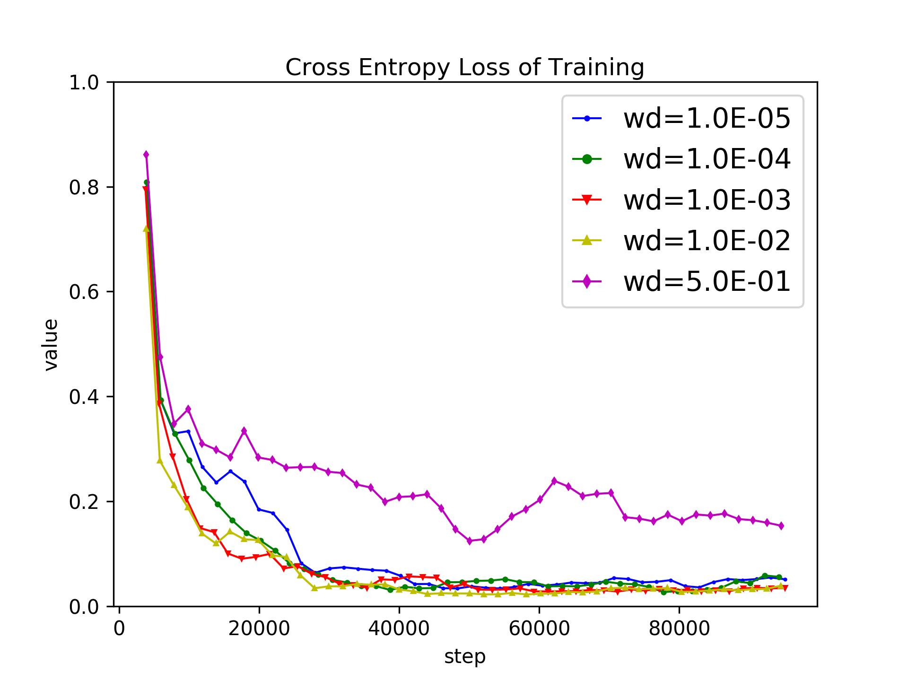

从训练结果看，权重过高的参数衰减会阻止损失函数持续下降，模型表现为欠拟合；当其小于某个阈值（本次实验中是0.5）时，这种阻止训练的现象消失，损失函数均可以持续下降至接近0的位置，模型表现为不同程度的过拟合。给定模型和数据集，我们无法知道完美的衰减项权重是多少，只有通过多次实验寻找。该参数的敏感度并不高，因此我们只需尝试不同数量级的值即可。 另外，从训练曲线的平滑度看，较弱的参数衰减项对应的训练过程更加稳定。

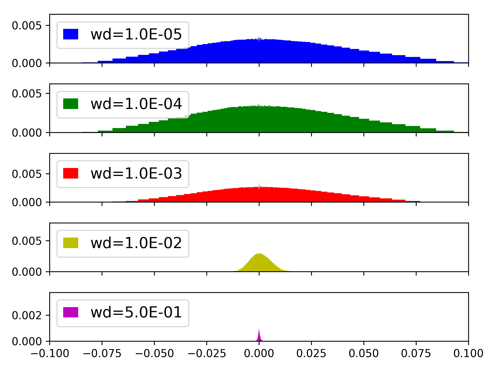

上图展示了训练完成时模型参数的分布，分布均呈现以均值0对称的的形状。衰减权重越小，分布的方差就越大。$wd=0.5$时，几乎所有的参数都集中在0附近很狭窄的区间，而$wd<=0.001$时，参数的分布区间扩大到$[-0.1, 0.1]$。这和前面的理论分析是吻合的，带衰减项的更新相当于先缩小参数值再正常更新。

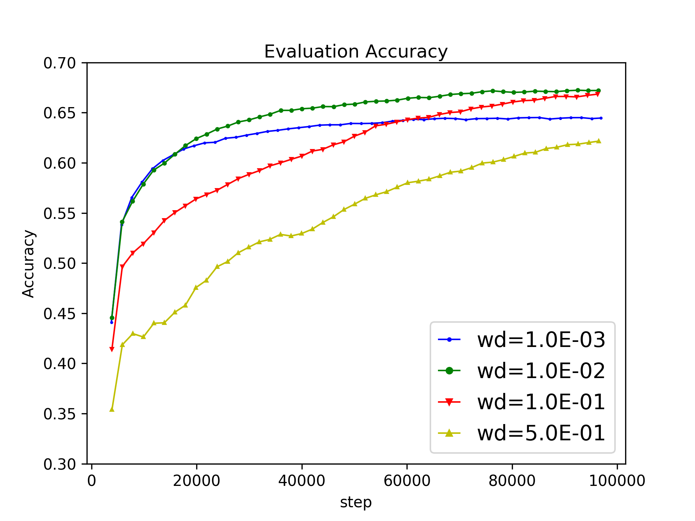

衰减项从强到弱，模型在测试集上的识别率呈现先上升后下降的趋势，这个过程中模型由欠拟合逐渐转变为过拟合。在$wd=0.5$条件下，识别率略高于$60\%$；当其下降为$0.1$时，识别率大幅度上升到$65\%-70\%$的区间；而当其下降到$0.001$及更小值时，识别率又回落到了$60\%-65\%$的区间。

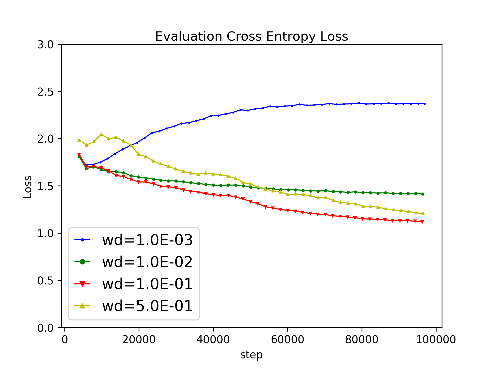

模型在验证集上的交叉熵损失随$wd$的变化趋势基本和识别率的趋势相同。然而，$wd$取很小的值时，损失值在一定迭代次数之后开始随着训练过程上升，甚至上升到了模型训练初期的水平，此时识别率仍然保持在$60\%$以上。这两个指标的定义确实不能保证它们是负相关的，即低的损失值对应高的识别率。试想调整模型对一个样本的输出的概率分布，只要保持真实类别上的概率是最大的，那么识别率就保持不变而损失值可能增加也可能减小。在本组实验中，为了控制变量，没有使用其他任何正则化方法，衰减项的权重对结果产生了十分显著的影响， 但是Chiyuan Zhang等人的工作以及经验告诉我们，当其他正则化方法存在时，衰减项对卷积神经网络的泛化性的影响并不显著，通常直接选取很小的值。

#### 3.2 随机梯度下降

##### 3.2.1 简介

神经网络的训练是一个非凸优化问题，可以被表示为
$$
min J(w) = \frac{1}{|M|} \Sigma J_i(w)
$$
M代表整个数据集，$J_i(w)$是损失函数在第$i$条数据上的取值。按照梯度下降的定义，应当求解$J$在所有数据上的平均梯度，但实际上几乎没有人这么做，而是随机的从数据集中选取一个很小的子集计算。基于这种梯度计算方式的梯度下降法被称为随机梯度下降法（SGD），其已经成为深度学习社区的标准优化方法。Bottou等人证明了它在非凸问题上可以收敛到平稳点，Ge等人的工作表明SGD可以帮助逃离非凸函数上广泛分布的鞍点。一次更新的公式如下
$$
w_{t+1}=w_t-\epsilon(\frac{1}{|B|} \Sigma {\nabla J_i(w)})
$$
B代表从M中随机抽取出的固定大小的子集，满足$|B|<<|M|$，通常$|B|\in {\{32,64,…,512}\}$。这种修改可以带来两个好处。第一，它使得梯度计算的时间复杂度不再和数据集大小成正比，而是一个常数。在百万级的数据集上，SGD相比原始的GD算法有上万倍的加速。第二，它为训练出的网络模型带来了更好的泛化能力。SGD训练出的网络比GD泛化性能好，基于较小batch-size（几十）的SGD相比较大batch-size（几百）的SGD，泛化性能还有进一步提升。Nitish等人研究了使用不同的batch-size训练的收敛点附近的性质，发现batch-size和损失函数在收敛点附近的黑塞矩阵的特征值的绝对值成负相关。他们的实验证实了，基于小batch-size的SGD因梯度估计偏差而引入的噪声非但没有干扰网络收敛，而且帮助网络逃离了陡峭的极值点而收敛于平坦的区域。

平坦的极值点意味着函数在这附近较大区域内的变化率都很小，而陡峭的极值点表示附近很小区域内的变化率就比较大。大的变化率会对泛化能力造成负面影响，这可以通过信息论中的最小描述长度（MDL）理论解释，MDL值越小的统计模型具有更低的复杂度，泛化能力可能也更好。平坦区域的MDL比陡峭区域小，因此是更好的收敛点。

##### 3.2.2 实验

batch-size太大会使得训练时间成比例的增加，太小则导致计算出的梯度不准确。为了测试batch-size的设置如何影响训练，我们设计了一组实验。实验的基本设置和上一节一致，我们使用LeNet和CIFAR10数据集。为了排除其他正则化方法的干扰，参数衰减的权重$\lambda$被设置为0，数据集扩增没有被使用。batch-size的取值包括了$[32, 64, 128, 256, 512, 1024, 2048, 5096]$，涵盖了三个数量级以期望获得显著的结果。大batch-size会占用过多的显存，为了解决这个问题以及加速训练，我们使用了多GPU同步训练，即将一个batch分为相等的两份，部署到两个GPU上计算梯度，先完成者会阻塞等待第二个GPU的结果，最后两者的均值用于更新参数。训练的其他参数和上一节中的保持一致。在模型的泛化指标方面，除了常规的识别率和交叉熵损失之外，我们还使用了Nitishi等人提出的sharpness。该值被定义为损失函数在收敛点附近的最大值和收敛值的比值。论文中使用$L-BFGS$求解，并认为该指标一定程度上可以代表损失函数的二阶梯度。他们认为小批量的噪声可以使得梯度下降法收敛于更加平坦的区域，模型输出具有更好的稳定性和泛化性。

##### 3.2.3 分析

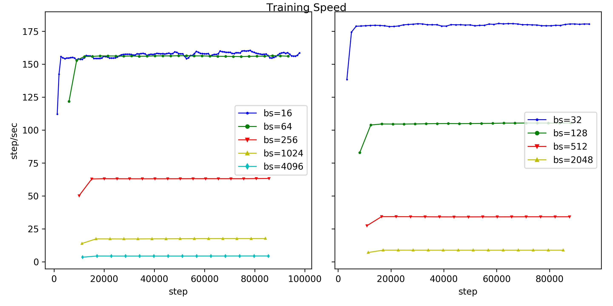

训练速度和batch-size呈现近似线性关系，batch-size为32时，每秒钟更新180次，而batch-size扩大到8192时，每秒钟的更新次数下降为2左右。

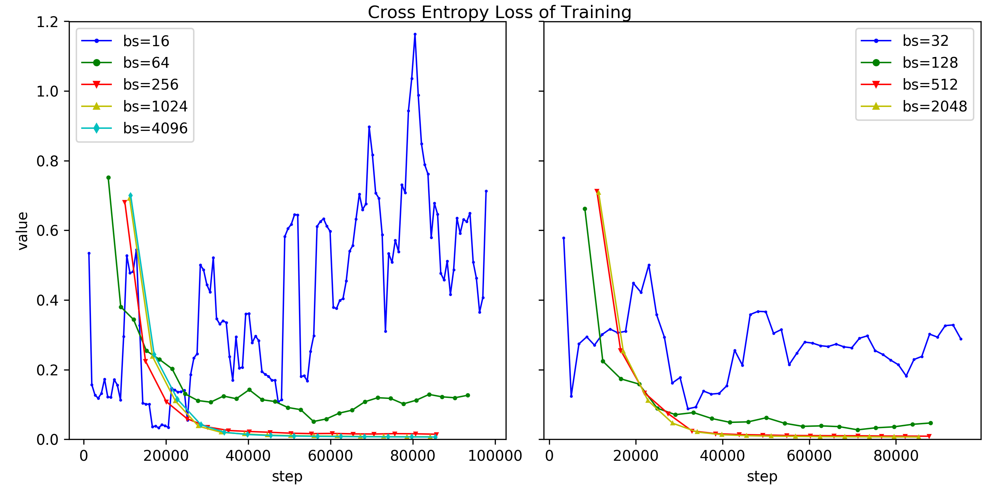

实验考虑了十种batch-size的取值，为了避免曲线重叠干扰观察，我们将其分为了两组，分别画在两个坐标系里，如上图所示。尽管batch-size的取值跨越三个数量级，但是损失函数都可以在波动中保持下降的趋势，这说明了使用小批量的数据确实可以得到可用的梯度估计。最明显的不同点是，batch-size越大，训练过程越稳定。其取值为几十时，损失函数上下波动十分剧烈，甚至在训练后期学习率很小时仍然不能收敛，此时模型表现为欠拟合；而其被设置为一千以上时，损失函数的变化过程接近平滑的曲线，训练可以达到收敛。另外，小批量训练的收敛速度并不比大批量快，这说明SGD的噪声帮助训练过程逃离鞍点的说法并不可靠，实际上在神经网络这样的特别高维空间里，陷入鞍点的概率是非常小的，因为那要求在每一个维度上的导数都等于零。

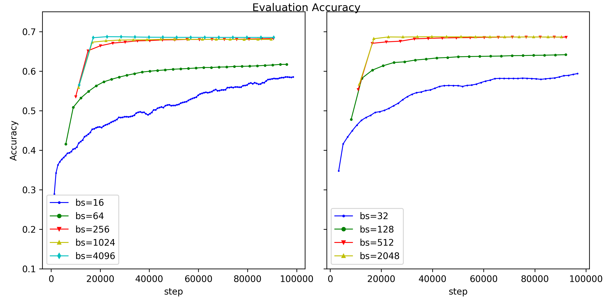

代表泛化能力的验证集性能方面，随着batch-size增加，识别率先上升后下降，这个结果符合预期。一方面，极小批量（几十）训练的模型的验证集表现较差，这应该是不准确的梯度导致梯度下降法不能向准确的方向进行，模型存在欠拟合。另一方面，这种不准确性随着batch-size增加而降低，当batch-size上升到256时，识别率有显著的改善。然而，继续增加该参数至数千到接近一万的过程中，验证集识别率没有显著的变化。这和我们的经验相悖，如果SGD的确有正则化的效果，那么在相等训练误差的条件下，越小的batch-size应该对应越好的泛化性能。在仔细阅读了一些文献后，我们发现大多数工作在考察batch-size时，都会把数据集遍历次数（epoch）作为不变量。这种做法是显然错误的，当epoch固定，大批量训练的迭代次数会比小批量少很多。我们的实验将迭代次数固定，大批量和小批量的泛化差异（gap）就不存在了。对于‘sharpness’指标，随着batch-size增加，该值有变大的趋势，但是大批量并不是严格的对应大的‘sharpness’。

| batch-size | sharpness |
| ---------- | --------- |
| 16         | 2.34      |
| 64         | 20.19     |
| 256        | 216.44    |
| 1024       | 327.93    |
| 4096       | 218.62    |

###### 梯度加高斯噪声？

#### 3.3 Dropout

##### 3.3.1 简介

在机器学习竞赛中出现频率很高的一种提升模型测试性能的方法是集成学习（ensemble learning），以bagging和boosting为代表。它们的基本思想都是使用多个弱分类器合成一个强分类器：bagging是从数据集中独立抽取M个子集，使用这些子集独立训练出M个分类模型，集成模型的输出由投票机制求得，即获得最多模型支持的为输出类别；boosting方法给样本增加了权重，每个样本对损失函数的贡献和权重成正比，每次训练结束后增加被误分样本的权重，那么在下一次迭代时模型会更加偏向这些样本，集成模型的输出由这些模型的加权组合得到。

方法

Dropout是bagging在神经网络上的一种高效近似，对于一个给定的网络结构，我们可以移除其中某些节点而得到一个更简单的网络，移除的策略有非常多种，如果非输出层节点都可以被移除并且其数量是N的话，那么有$2^N-1$种不同的简单网络。单独训练这些简单网络然后集成它们的结果，我们可以期待显著的测试性能提升。但这不具备可行性，因为模型数量过于巨大。Dropout的做法是在训练时每个节点乘以一个服从伯努利分布的随机变量$x$，而在测试时节点的输出等于激活值乘以随机变量的期望$E(x)$，$x$的分布如下面的公式。训练阶段，网络关于每条数据的前向计算都会对$x$采样，如果采样值为$0$，无论激活值是多少该节点的输出都为$0$，就好像这个节点以及它前后的连接都被移除了；如果采样值为$1$，那么该节点得以保留，输出值等于激活值。$p$是一个超参数，和大多数正则化方法的超参数一样，该参数也控制了Dropout的强度。靠近1时大部分结点会被去掉，一次迭代只更新少部分参数，更新所有的参数需要很多次迭代，如果迭代次数有限则可能发生欠拟合；靠近0时大部分结点得以保留，Dropout的正则化约束可能不够。测试阶段，所有的结点都得以保留，一个结点的激活值大致等于$1/p$个训练时的子结构的输出的加和，为了消除这种数值偏差，测试阶段所有的权重被乘以$p$。
$$
P_r(x) = \left\{
             \begin{array}{lcl}
             {p^x(1-p)^{1-x}} &\text{if} &x=0,1 \\
             {0} &\text{if} &others  
             \end{array}  
        \right.
$$
按照bagging的定义，集成模型的输出应当是所有简单模型的输出的算术平均，Bengio等人使用几何平均近似算术平均，并假设网络是一个单层的softmax分类器的情况下，推导出了集成结果等于权值缩放后的单个网络的结果。这个结论在不包含非线性激活函数的深层网络中也成立，在包含非线性激活函数的网络上的实验表明dropout可以很好的工作。获得集成输出的另一种高效方法是抽样近似。Goodfellow等人在实验中发现其效果不如权值缩放，即便是抽取上千个子网。但是Gal等人发现在有些模型上二十个子网络样本的集成效果就比权值缩放后的单个网络好了。Srivastava等人的工作表明Dropout的效果比其他不显著增加成本的正则化方法效果好，比如$l1$和$l2$正则。并且，Dropout可以和这些正则化方法一起使用，以获得额外的测试性能提升。

Droput带来的好处也并不是完全没有成本的。实验表明它会减缓模型的收敛速度，从而增加训练时间。可能的原因是，子网络的权值是共享的，每次更新权重都会修改到许多子网络的部分权重，而不像训练单个网络时所有权重会被同步更新。也可以从梯度噪声的角度解释，那些乘零操作可被看做一种随机噪声，噪声引起的梯度偏差干扰了梯度下降法，但是也增加了模型的泛化能力。

既然Dropout可以看成是节点输出乘以一个伯努利分布的采样值，那么一个自然的疑问它是否可以扩展到其他随机分布呢？Srivastava的工作表明这是可行的。他们发现将激活值乘以一个相比伯努利分布随机性更强的正态分布的随机量也可以很好的约束网络，甚至可以取得比原始的基于伯努利分布的Dropout更好的泛化性能提升，这增加了Dropout是一种基于噪声的正则化方法的观点的可信度。这种乘法形式的噪声也可以写成加法形式，下面两组定义是完全等价的。
$$
\left\{
\begin{array}{lcl}
h_i^{'} = h_i r \\
r \sim N(1, 1)
\end{array}  
\right.
$$

$$
\left\{
\begin{array}{lcl}
h_i^{'} = h_i+h_i r \\
r \sim N(0, 1)
\end{array}  
\right.
$$

正态分布的标准差可以被作为一个超参数$\sigma$，设置为其他值可能获得更好的约束性能。无论$\sigma$的取值是多少，$h_i^{'}$的期望值始终等于$h_{i}$而不改变，所以测试阶段不需要权值缩放。原始的Dropout也可以转变为这种形式，如果在训练时将参数乘以$1/p$，那么测试时就不再需要缩放操作了。转换后的随机变量服从下面的分布，并且$h_i'=h_ix$，这样就将基于两种分布的Dropout统一到一致的形式了。我们可以通过设置一样的均值、方差，来比较它们的优劣。也可以同时使用两种分布，即$h_i'=h_irx$，观察是否会相比基于单个随机变量的Dropout获得额外的性能提升。
$$
P_r(x) = \left\{
             \begin{array}{lcl}
             {p} &\text{if} &x={1/p} \\
             {0} &\text{if} &others  
             \end{array}  
        \right.
$$

##### 3.3.2 实验

为了测试不同的Dropout强度对模型训练和泛化能力的影响， 我们设计了一组对比实验。实验使用的数据集仍然是$CIFAR-10$，使用的网络模型是基于前面的$CIFAR-Net$的变体，模型的最后一层全连接层之后（输出层之前）被加入了一个Dropout层。同样的，为了控制变量，参数衰减和数据扩增等正则化方法都没有被使用。考察的$p$值包括$[0.0, 0.25, 0.5, 0.9]$。为了探究Dropout的工作原理，我们将伯努利分布替换为高斯分布，其均值为1，方差$\sigma$是一个可调整的超参数。通过调整该参数，观察其如何影响模型的泛化能力。$\sigma$的取值包括$[0.1, 0.5, 1.0, 1.5, 2.0]$。另外，我们还尝试了同时应用服从伯努利分布的噪声和服从高斯分布的噪声，观察是否会相比于单独应用这两种正则化方法得到额外的泛化性能提升。

##### 3.3.3 分析

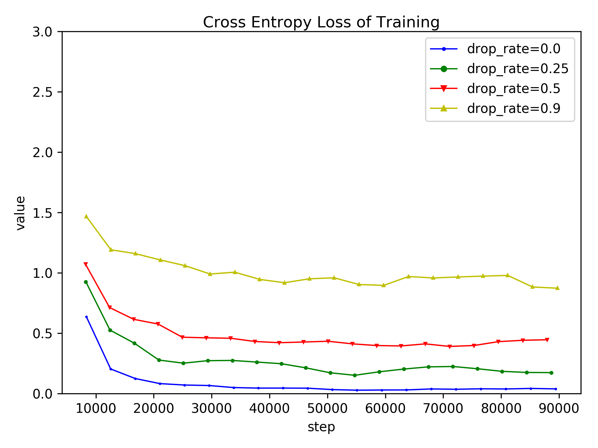

Dropout的训练曲线和大多数正则化方法一样，和正则化强度相关的超参数越大，模型就越不能完美的拟合训练集。当伯努利分布的$p$值被设置为0时，几乎不会有结点被去掉，训练集误差可以收敛之接近0的位置；当$p$增大时，收敛点也逐渐增大；当$p=0.9$时，每层仅$10\%$的结点得以保留，收敛时的损失值在$1$左右，此时模型表现为欠拟合。

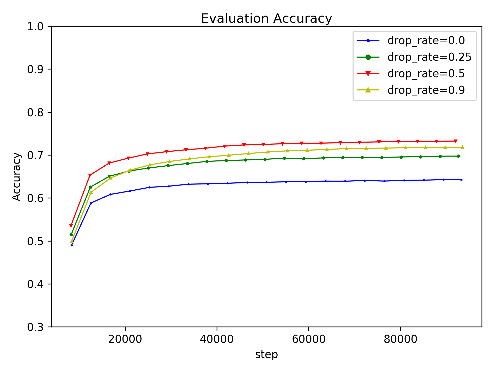

从上面的图可以看出，Dropout大幅度提升了验证集的识别率。没有Dropout时，识别率为$64.25\%$；添加强弱程度不等的Dropout后，识别率有不同程度上的提高，其中$p=0.5$时识别率达到了$73.31\%$，相比修改前的网络模型提升了接近十个百分点。从交叉熵损失这个指标来看，Dropout和参数衰减一样，可以阻止训练后期交叉熵的上升，越大的$p$值对应越小的交叉熵。如果把训练集和测试集的交叉熵相减，得到的差值可以被视为泛化间隔（gap），下表列出了不同$p$值的泛化间隔。Dropout可以明显的提升模型在训练和测试数据上的表现的一致性，当$p=0.9$时，泛化间隔接近于0，此时可以认为不存在过拟合。

| drop rate | 训练集交叉熵 | 测试集交叉熵 | 泛化间隔  |
| --------- | ------ | ------ | ----- |
| 0.0       | 0.04   | 2.59   | 2.55  |
| 0.25      | 0.18   | 1.19   | 1.01  |
| 0.5       | 0.45   | 0.84   | 0.39  |
| 0.9       | 0.88   | 0.81   | -0.07 |

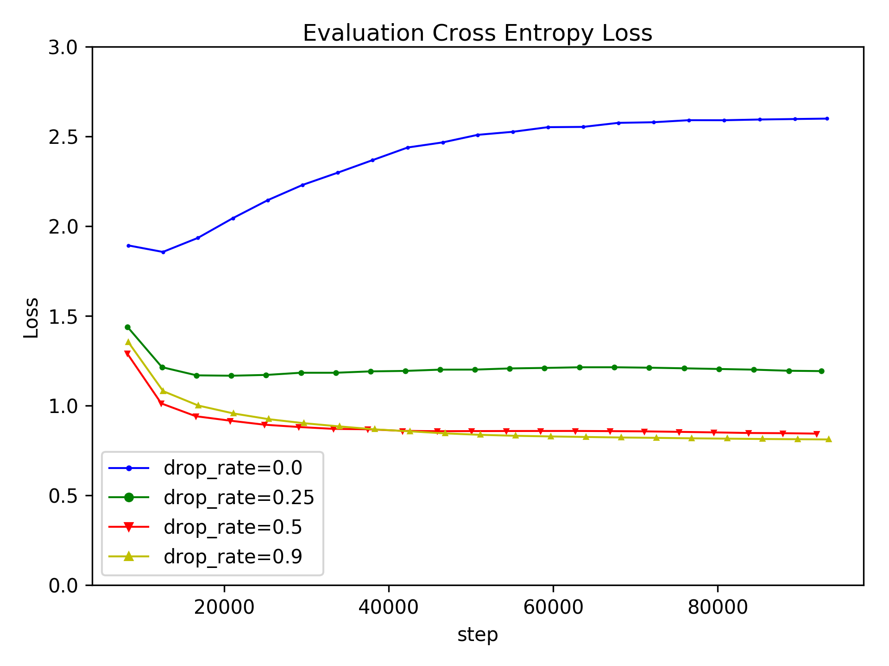

高斯噪声对模型训练和泛化性能的影响和原始的Dropout类似。一定强度的乘性高斯噪声可以显著增加验证集识别率，其中标准差为$1.5$时识别率达到最高$74.24\%$。相比不施加噪声时的$64.25\%$有接近十个百分点的提升，并且超过了原始Dropout的最优结果$73.31\%$。结合两种随机分布的Dropout并不能获得额外的性能提升，这说明Dropout的工作原理很可能是噪声引入而不是模型集成。

#### 3.4 Batch Normalization

##### 3.4.1 简介

很多问题的输入特征的维度都会比较高，复杂的线性回归可能涉及数十到数百个变量，而图像通常都是由上万个像素组成的。不同维度的特征的数量级（scale）可能有很大的差别，大量级的特征对模型输出的贡献也大，这样就可能出现小量级的特征被抑制，模型输出主要由少数大量级特征决定的情况。因此，我们在应用机器学习解决实际问题时，通常会先对特征做标准化（Normalization）预处理。具体的，使用下面的变换使得各个特征具有零均值和单位方差。
$$
x_i=\frac{x_i-\overline {x_i}}{\sigma _{x_i}}
$$
在具备层次化结构的神经网络中，情况会更加复杂。输入特征会经过多次变换，其分布会不断变化。某一层的输入由前面所有层的参数决定，所以微弱的参数变动也会在网络中被放大，数据的标准化特性在前向传播过程中难以被保留。Sergey Ioffe等人提出了Batch Normalization（BN）方法，其主要作用是加速网络训练，并同时带来了正则化的效果。

方法

BN层是一种独立的神经网络组件，可以被应用到任一隐含层。设$m*n$的矩阵$H$是某一层的输入特征，$m$是batch size，$n$是特征维度，$i$是样本的索引，$j$是特征的索引，BN的输入输出关系由下面的式子定义。
$$
BN(H_{ij})=\frac{H_{ij}-u_j}{\sigma _j}
$$

$$
\mu _j=\frac{1}{m}\sum_{i=1}^{m}H_{ij}
$$

$$
\sigma _j=\sqrt{\epsilon+\frac{1}{m}\sum_{i=1}^m (H_{ij}-\mu _j)^2}
$$

其中，用于标准化的均值$u$和方差$\sigma$是常数，训练时由batch内的数据计算得到，测试时由整个数据集算得。

BN已被许多实验结果验证了有效性，自被提出后已经被应用到了很多种网络结构中，都能够取得加速训练和减小测试误差的效果，比如目前最流行的ResNet重度使用了这种结构。尽管如此，它的工作原理仍然不是很明确，深度学习社区也没有非常一致的看法。BN的提出者Sergey Ioffe在其论文中使用了"Internal Covariant Shift"来解释，"Covariant Shift"是迁移学习中的一个概念，它指出特征分布的偏移会导致已训练好的判别函数的失效，因为判别函数的学习依赖了误差在特征分布上的期望。神经网络训练时，参数变化会导致每一层的输出的分布都发生改变，作者把这种存在于相邻隐含层的分布偏移称之为"Internal Covariant Shift"，而BN的加入可以基本固定每一层输出的分布的均值和方差。笔者认为这样的解释有明显的漏洞，"Covariant Shift"的适用场景是映射关系$y=F(x)$相同、自变量$x$的分布不同，而神经网络中每层的映射本身是不同的，因此这个概念并不适用于神经网络。另外，当我们讨论$x$的分布时，应当是针对其所有分量的联合分布，单独标准化每个分量对联合分布的影响是未知的。\<Deep Learning\>一书中针对BN给出了不一样的分析，它以一个极为简化的由单节点层组合的网络为例，说明了神经网络模型的局部不能够线性近似，只考虑一阶梯度的SGD会产生意想不到的结果，但是没有推导BN是如何解决这样的问题的，也没有说明简化模型的分析能否泛化到更一般的神经网络。

另外，实际应用BN层时，标准化操作后面会有一个额外的线性变换，设$H^{'}$是标准化后的特征，BN的实际输出等于$H^{'}*\gamma+\beta$，其中$\gamma $和$\beta$是可训练的参数，分别被初始化为$1$和$0$。原论文的解释是，标准化会减弱神经网络的表达力，$\gamma$和$\beta$的加入就是为了弥补这种损失。这似乎和添加BN层的目的背道而驰，但是在实验中起到了好的效果。一个有意义的实验是去掉这个线性变换，BN层还能很好的发挥作用吗？遗憾的是，原论文中没有相关的论证。

BN层除了稳定分布和加速训练的功能，还可以显著降低测试误差，所以它也是一个重要的正则化方法。其带来的泛化能力提升可以归结到随机噪声的框架下。BN层进行标准化时，使用的均值和方差是在一个batch的数据上求得的。样本的丰富性和抽样的随机性会使得每一个batch，使用的均值和方差不一样；同一个样本的每一次出现，使用的均值和方差也不一样。

尽管其原理尚未明确，但BN仍然是近几年深度学习研究领域最重要的成果之一。

##### 3.3.2 实验

为了观察Batch-Norm对训练速度和学习率敏感度的影响，我们设计了一组实验。基于3.1节中的$CIFAR-NET$，我们向其中添加了3个Batch-Norm层。修改后的网络结构如下表。

| 层    | 1                            | 3    | 4                           | 6    | 7    | 8    | 9    |
| ---- | ---------------------------- | ---- | --------------------------- | ---- | ---- | ---- | ---- |
| 类型   | conv-pooling                 | bn   | conv-pooling                | bn   | fc   | bn   | fc   |
| 参数   | $3\times3\times64, 2\times2$ |      | $3\times3\times64,2\times2$ |      | 384  |      | 10   |

在前面的实验中，模型对学习率比较敏感，初始学习率均被设置为$0.01$，更大的值将导致模型训练失败。修改后的网络理论上将可以适应更高的学习率，所以我们尝试了$0.1, 0.5, 1$。训练参数如下表所示。

| 参数名        | 取值                                       | 备注         |
| ---------- | ---------------------------------------- | ---------- |
| 模型         | Cifar-Net-BN                             |            |
| 数据         | CIFAR-10                                 |            |
| 优化方法       | SGD                                      |            |
| Batch-Size | 128                                      |            |
| Momemtum   | 0.9                                      |            |
| 迭代次数       | 100K                                     |            |
| 学习率        | $[0.01, 0.1,0.5,1]*0.91^{\lfloor step/2000 \rfloor}$ | step是已迭代次数 |
| 参数衰减权重     | 0                                        |            |

##### 3.3.3 分析

实验结果表明Batch-Norm可以显著降低训练过程对学习率的敏感性，实验中设置的三组大学习率都不会阻止模型收敛。泛化性方面，Batch-Norm可以大幅度提升识别率至$70\%$以上。但是，大学习率并没有显著加快模型的收敛速度，$lr=0.1$的条件下？次迭代后损失值下降到？，而在$lr=1$的条件下也经过了差不多的?次迭代才下降到？。原因可能和梯度下降法的工作原理有关，它假设优化函数的局部是线性的，因此参数沿着一阶梯度的反方向移动可以快速降低目标函数值。当学习率设置得较大时，局部其实一个较大的区域，线性关系可能不再成立。这种情况下，参数的更新步长中只有开始的一小段是有效的。另外，我们观察到大学习率训练可以得到更高的测试集识别率，Sergey在他们的论文中也表述了类似的结果，其原理值得进一步研究。

#### 3.5 数据扩增

##### 3.5.1 简介

！！！【显式、隐式介绍】

大多数机器学习模型都可以在更大的数据集上取得更好的表现。如果模型的训练可以看成函数拟合的过程，更多的数据可以更准确的描述数据的分布，从而降低离群点（outlier）对模型的影响。所需的数据量和特征空间的容量（capacity）正相关，而这又和特征的维度呈指数关系。随着特征维度的增加，模型对数据的需求会变得十分苛刻。这在CNN上体现得很明显，因为它要处理的图像数据通常都是数万到数百万像素的。然而，在处理实际问题时可用的数据是有限的，获取新的标注数据的成本可能很昂贵。一种解决方法是使用现有数据合成新数据并加入到训练集，这就是数据扩增。一般的做法是对特征$x$施加某种变换（transform）$F(x)$，但不改变目标变量$y$的取值。变换不会造成目标信息的改变，这一点非常重要，否则我们生成的数据和原始数据集表达的映射关系是不一致的，从而对模型训练造成负面干扰。选择什么样的变换，需要利用领域知识（domain knowledge），厘清哪些因素是输出的因变量，而哪些因素是无关变量，数据扩增一般就是对后者的模拟（simulation）。在设计数据扩增的策略时，必须注意不能引入会改变图像类别的因素。以旋转操作为例，大多数情况下，水平翻转是合理的而垂直翻转是不合理的，我们可以观察到朝向左边和右边的汽车，但是一般情况下不会看到四轮朝天的汽车。而有时候，水平翻转也是不合理的，比如在字母识别的任务中，b翻转后就变成另一个类别d了。

对于基于CNN的图像分类问题，数据扩增特别容易实施。图像的生成过程受到众多因素影响，诸如光源位置、光照强度、拍摄距离和拍摄角度等，可以说每一张照片都不可避免的和这些因素相关，但是它们不影响我们识别出里面的物体的类别。这些因素，一方面增加了模型泛化的难度，另一方面也给数据扩增提供了条件。模拟这些因素的变化，可以得到一幅图像的多个变体。对整个数据集做这样的操作，数据量可以被扩大数倍到数十倍。大量实验证明了数据扩增的有效性。LeCun在提出LeNet的工作中针对MNIST数据集使用了一系列复杂的图像变换， 这是第一个成功的CNN模型；Krizhevsky在提出AleNet的工作中使用了随机裁剪、水平翻转和PCA分析等操作，这是第一个应用于复杂分类问题的CNN模型；2014年ILSVRC的冠军模型VGGNet还额外结合了尺度缩放操作扩增数据集。

几乎所有的基于CNN的工作都会使用多种数据扩增操作，并且同时使用多种前面介绍的正则化方法，比如参数衰减和Batch-Norm。然而，大部分工作只给出最后的性能指标，很少论文会给出使用正则化方法前后的性能差异，几乎没有工作会列出单独使用某一种正则化方法的效果。Chiyuan Zhang等人报告了简单的随机裁剪可以大幅提升InceptionNet在ImageNet数据集上的识别率，从59.80%到67.18%。【X？】比较了不同强度的数据扩增方法对泛化性提升的程度。他们的实验中定义了由随机裁剪和随机翻转组合得到的“轻扩增”和由额外的复杂仿射变换共同组合得到的“重扩增”，实验结果表明“轻扩增”显著提升泛化性，“重扩增”只能得到相比“轻扩增”很微弱的额外提升。“轻扩增”中起主要作用的也是随机裁剪。其他策略，例如调整图像的色相、饱和度等特性也可以产生一定的正则化效果，但是我们的初步实验显示这些操作的提升远不如随机裁剪。因此，随机裁剪操作的高度有效性是一个值得探究的点。

随机裁剪对卷积神经网络前向、后向计算会产生显著影响。卷积运算是在图像的各个局部独立进行的，在裁剪后的图像上进行卷积得到的特征图尺寸会小一些，就相当于先在完整的图像上卷积再裁剪掉特征图的对应边缘。如果输出特征图被向量化（flatten），即拼接每一个行向量，那么裁剪的效果是丢弃了某些特征并轻微的扰乱了保留特征的排列，这和Dropout有一定共同之处；如果输出特征图后面是一个全局均值pooling层，那么裁剪会对输出均值产生扰动，可能正值扰动出现的概率更大，因为通常图像边缘的激活值小于均值。从训练的角度看，特征的排列和数值变化会使得全连接层看到一个样本的多个变种，这至少会增加记住每一个样本的难度，即降低了过拟合的风险。随机裁剪对卷积层训练的影响应该是很微弱的，因为后向传播过程中卷积层的梯度是在特征图的每个位置上的平均，梯度和某个位置的激活值是一种松耦合的关系。

##### 3.5.2 实验

上面的分析推测随机裁剪训练图像相当于随机裁剪最后一层特征图，我们将通过实验来比较这两种操作对模型训练和泛化性的影响。实验使用的数据集仍然是$CIFAR-10$，网络仍然是基于$CIFAR-NET$。一方面，我们使用基本的数据扩增操作，在$32\times32$的图像的四个方向上以$0$填充$4$个像素，再在$36\times36$的图像上随机裁剪出$32\times32$的样本。另一方面，我们直接再最后一层$8\times8$特征图上裁剪，为了达到一致的正则化强度而具备可比性，四个方向均填充$1$个像素。这样，填充后的图像的长和宽都比原来增加$1/8$。 我们还将两种策略组合，同时在原始图像和最后一层特征图上进行填充和随机裁剪操作，使用的参数分别和前面一样。训练参数如下表所示。

| 参数名        | 取值                                      | 备注         |
| ---------- | --------------------------------------- | ---------- |
| 模型         | Cifar-Net                               |            |
| 数据         | CIFAR-10                                |            |
| 优化方法       | SGD                                     |            |
| Batch-Size | 128                                     |            |
| Momemtum   | 0.9                                     |            |
| 迭代次数       | 100K                                    |            |
| 学习率        | $0.01*0.91^{\lfloor step/2000 \rfloor}$ | step是已迭代次数 |
| 参数衰减权重(wd) | 0                                       |            |
| 图像填充       | [4, 4, 4, 4], 0                         | 简称IP       |
| 特征图填充      | [1, 1, 1, 1], 0                         | 简称FP       |

##### 3.5.3 分析

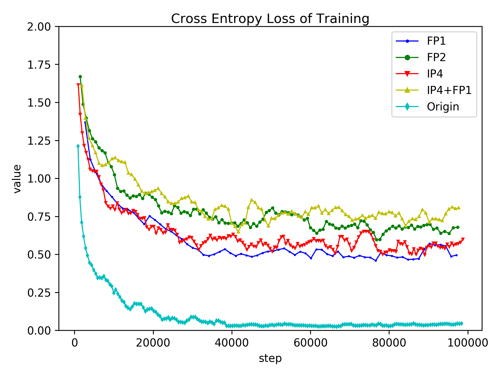

平滑的下降曲线表明训练比较稳定且能收敛，和其他显式正则化方法一样，数据扩增可以阻止模型完美的拟合训练集，训练结束时损失函数值并没有将至0附近的位置。从测试集的指标来看，两种方法都可以大幅度提升识别率。可以观察到三个现象

- $FP1$可以达到和$IP4$可比的泛化性提升，甚至还略微更好
- $FP1$和$IP4$同时使用并不能获得更好的效果，甚至比只应用单个时的效果稍差
- $FP2$的效果和$FP1+IP4$接近

如果上一节的分析是正确的，那么这些实验结果都可以得到非常合理的解释。$IP1$和$FP1$叠加使用，相当于在原始图像的各个方向上填充了8个像素，再裁剪后原来的尺寸，这种扩增强度可能过大，因此造成了拟合精度上的下降。$FP2$也是类似的问题，特征的排列变化可能太大，干扰全连接层训练。除了轻微的额外泛化性提升，$FP$还有提升训练速度的优势。既然随机裁剪对卷积层训练没有帮助，那么我们可以多次随机裁剪同一份特征图，执行多次更新梯度，即$N$次更新只涉及一次前向卷积和多次后向传播。

| 方法      | 识别率    | 训练损失值 | 测试损失值 |
| ------- | ------ | ----- | ----- |
| 原始      | 64.39% | 0.04  | 2.60  |
| IP4     | 75.02% | 0.54  | 0.77  |
| FP1     | 76.77% | 0.49  | 0.68  |
| IP4+FP1 | 73.01% | 0.74  | 0.80  |
| FP2     | 73.88% | 0.69  | 0.76  |

#### 3.6 混合

### 4. 一种新的正则化方法：特征扩增

数据扩增作为一种简单而有效的方法，已经成为训练CNN时的标准操作。但是，数据量不足的问题不能够简单的通过扩增解决。目前大多数数据扩增方法都是在输入层，即原始图像上进行的。我们认为这样的操作也可以被应用到隐含层产生的特征图上。CNN是一个多层次的特征提取器，当前层的输出特征是下一层的输入特此。从卷积层的角度看，原始图像和中间的特征图都是具有多个通道和二维结构的数据表示，只是代表的抽象层次不同而已。因此，特征图可以被看成具有很多个通道的图像。自然的，那些被应用在RGB图像上的扩增操作也可能适用于特征图。我们把在特征图上的扩增操作称为特征扩增（Feature Augmentation）。在这项工作中，我们提出了特征扩增层（AugLayer），它对输入特征图执行某种修改，输出一份信息得以保留的特征图变体。AugLayer可以被使用在任何CNN中，使用方式是插入到卷积层之前。添加的AugLayer数量是一个超参数，并不是每个卷积层对应一个AugLayer，添加得过多可能会造成模型欠拟合，添加得过少则取得的效果不明显。对于一个特定的网络结构，该超参数的最优取值需要多次实验确定，不过经验表明，每次特征图尺寸减小时加入一个AugLayer是不错的选择。为了测试AugLayer的正则化效果，我们把它添加到ResNet中，对比添加前后的网络的训练过程，观察训练误差、测试误差以及这两个量之间的差值有什么样的变化。另外，我们还尝试调节AugLayer的数量，观察它如何影响网络的拟合能力和泛化能力。

#### 4.1 特征扩增层

我们的实验考虑了两种扩增操作：对比度变换和亮度变换。下面介绍它们的基本原理、计算方法和参数设定。

对比度调节通常是作为图像增强的手段被广泛使用。对比度反映的是相邻平面反射的光线的差异，在物理世界里，同一个场景的不同对比度的影像是很容易被观察到的。对于数字图像，我们也可以很容易的调节它的对比度而生成变体。对比度变换按照下面的式子计算
$$
I^{'}=(I-m)*f+m
$$

$$
f \sim U(1-\alpha,1+\alpha)
$$

其中，$I$表示一幅图像或一个特征图，$m$是在每个通道上单独求得的均值，$f$是调整比率。$f$大于一时像的对比度会被增强，小于一时减弱，等于一时扩增操作不变产生任何改变。实验中，各个通道的$f$是独立且都服从相同的均匀分布的。其具有以下两个性质
$$
p(f>1)=p(f<1)=0.5
$$

$$
E(f)=1
$$

每次前向计算时使用的$f$通过抽样得到，这意味着同一层的某些通道的对比度会被增强，而另一些被减弱，并且所有通道的累加会保持大致相等。我们也尝试了增强所有特征图的对比度，但是得到了更差的测试集识别率，这可能是因为扩增操作在训练集上引入了一个数值偏差。$\alpha$被经验性的设置为$0.25$。下面的图片展示了分别在原始图像和特征图上做对比度变换的效果。

亮度变换也是简单常见的图像处理方法。图像的亮度反映了图像生成时环境中的光照强度，但是明暗变化一般不影响图像的类别，所以光照自然的可以被用来扩充数据集。亮度变换按照下面的式子计算
$$
I^{'}=I+stdv*f
$$

$$
f \sim U(-\beta,\beta)
$$

其中，$I$和$I'$分别是调整之前和之后的图像或特征图，$stdv$是在每个通道上计算得到的标准差，$f$是调整系数。$f$为正值时，图像亮度被增强，反之减弱。和对比度变换中的一样，每个通道的$f$参数从一个关于$0$对称的均匀分布上独立抽样得到。这意味着，对于同一层的多个特征通道，某些会变亮而某些被调暗。变换前后，给定空间位置上的所有通道的值的和会保持大致不变。$\beta$被设置为$0.05$，更大的取值会《干扰训练》。

4.2 分析

#### 4.2 ResNet实验

##### 4.2.1 实验设置

为了衡量AugLayer的效果，我们实现了一个改进的ResNet，并测试其在CIFAR10数据集上的表现。我们基本遵循了原始的ResNet的超参数，首先在图像上应用一个卷积层而得到底层特征图，然后是$6n$个卷积层逐步提取抽象特征。所有卷积层的卷积核都是$3 \times 3$的。每$2n$层被称为一个阶段，每2层是一个单元（包含了bn层和残差结构），$n$是一个超参数，表示单元重复的次数，不同的取值得到不同层数的网络。第一个阶段的卷积层均是16组卷积核，特征图尺寸和输入一样保持为$32 \times 32$，而第二、三阶段，卷积核组数均加倍，特征图尺寸均减半，所以最后的特征是64通道、$8 \times 8$尺寸的。特征图后面是一个全局的avg-pooling和softmax层。

| 层    | 1             | 2n            | 2n            | 2n            | 1            | 1       |
| ---- | ------------- | ------------- | ------------- | ------------- | ------------ | ------- |
| 类型   | conv          | conv          | conv          | conv          | avg-pool     | softmax |
| 参数   | $16,3\times3$ | $16,3\times3$ | $16,3\times3$ | $16,3\times3$ | $8 \times 8$ | $10$    |

所有带参数的层的数量是$6n+2$。实验中，$n={1,2,3,5,7}$，得到${8,14,20,32,44}$层的网络。我们将AugLayer添加到网络的某些位置。为了更好的观察它的作用，我们采取了两种策略引入AugLaer，一是在每个阶段的开头插入一个AugLayer，另一个是每隔两个卷积层插入一个AugLyaer。我们还将Dropout和图像扩增作为参考方法加以比较。Dropout被添加到$avg-pool$层之后，随机的将$50\%$的特征置零。图像扩增随机的调节图像的对比度和亮度，参数设置和上一节中描述的一样。网络训练使用随机梯度下降法。基本参数设置如下。

| 参数      | 值      |
| ------- | ------ |
| 冲量      | 0.9    |
| 初始学习率   | 0.1    |
| 参数衰减    | 0.0001 |
| batch大小 | 128    |
| 总周期     | 200    |

在第120和第160个周期，学习率下降为之前的$10\%$。在所有的实验中，我们都使用了基本的数据扩增方法，包括随机裁剪和随机翻转。具体的，图像的四个方向都被填充了4个像素，像素值和图像边缘相同，然后随机裁剪出$32\times 32$的图像，这些图像又以$0.5$的概率被水平翻转。训练机器装配了一块GTX 1080图像处理器，一次训练的耗时根据网络层数在1~4个小时不等，AugLayer的引入使得训练时间增加了$5\% \sim 10\%$。

##### 4.2.2 结果

下图展示了在特征图上进行对比度变换可以有效的正则化网络。“normal”表示基本的实验设置，包括归一化预处理，随机裁剪和随机翻转，其他三个设置都是独立的在基本设置上修改的；“image-contrast”表示额外地随机调整图像的对比度；“feature-contrast”表示在额外引入了三个特征扩增层；“feature-contrast-more”表示在每两层卷积后都加入一个特征扩增层。所有的设置都可以达到收敛，在第120周期第一次降低学习率后，损失函数很快接近了最低值。虽然包含特征扩增层的网络的训练误差一直相对较高，但是它们最终的测试误差更低，这意味着特征扩增层显著的减小了训练和测试的间隔。这种现象在引入更多的特征层时更为明显。加入基于对比度变换的特征扩增层后的网络的训练曲线与之类似，但是正则化的效果要弱一些。

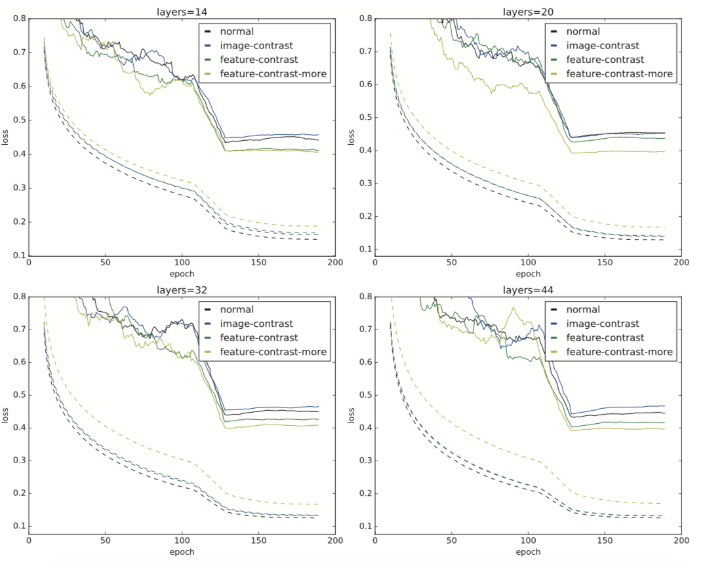

表格1和表格2列出了各种实验配置下的测试集误差和识别错误率。表格1显示对比度扩增层可以一致性的促进网络具有更好的泛化能力。更多的扩增层得到了更低的测试集误差，错误率也有类似的趋势但是更多的特征扩增不总是对应更低的错误率。表格1的第三列显示在ResNet的全连接层后加入Dropout层不能得到额外的泛化性提升。我们也尝试了把所有的特征扩增层替换为Dropout层但是泛化性指标有明显的下降。表格2显示亮度扩增也可以轻微的增加模型的泛化能力。其对测试集误差的降低不如对比度扩增明显，更多的扩增层并不对应更好的测试集指标。

表1

| config |   normal    |   dropout   | image- contrast | feature- contrast | feature- contrast-more |
| ------ | :---------: | :---------: | :------------------: | :--------------------: | :-------------------------: |
| 8      | 0.46(11.6%) | 0.48(13.2%) |     0.51(11.9%)      |      0.43(11.2%)       |           0.42(%)           |
| 14     | 0.45(9.00%) | 0.45(9.16%) |     0.46(0.52%)      |        0.41(%)         |           0.41(%)           |
| 20     | 0.47(8.45%) | 0.49(7.92%) |     0.48(8.78%)      |        0.44(%)         |           0.40(%)           |
| 32     | 0.45(7.70%) | 0.59(7.99%) |     0.43(7.38%)      |        0.43(%)         |           0.41(%)           |
| 44     | 0.45(7.03%) | 0.58(7.44%) |     0.47(7.24%)      |        0.42(%)         |           0.39(%)           |

表2

| config |      |      |      |      |      |
| ------ | ---- | ---- | ---- | ---- | ---- |
| 8      |      |      |      |      |      |
| 14     |      |      |      |      |      |
| 20     |      |      |      |      |      |
| 32     |      |      |      |      |      |
| 44     |      |      |      |      |      |

### 5. 总结

本文探讨了针对卷积神经网络的常见正则化方法的原理和效果。为了达成这个目的，论文包含了三个方面的内容：背景知识、现有正则化方法的分析和一种新的正则化方法的提出。

背景知识章节涵盖了理解本论文所必需的知识，包括卷积神经网络的构建、训练和优化。卷积神经网络作为专用于处理图像数据的子类型，和一般的神经网络有很多共同点。它们是一种层叠式结构的计算图，表达了一种数据到另一种数据的映射。通过调整计算图中的连接权重等参数，神经网络可以表达出有意义的映射。这是通过训练来实现的，训练使用了凸优化的基本工具梯度下降法，降低定义在训练集和参数上的损失函数值，调整映射关系。然而，神经网络结构的通用性和表达式的复杂性导致其不可具体分析，我们不能够知道它学到了什么，无法保证它在非训练数据上的表现。目前的神经网络正则化方法是借鉴经典的统计机器学习理论中的复杂度和泛化性而提出的，大多是用结果的正确性来支持借鉴的合理性，这缺乏严密的逻辑性。

现有正则化方法分析章节介绍了几种最常用的正则化方法，独立测试了各种方法的超参数对训练和泛化性的影响，以及探究了部分方法的工作原理。实验以一个简单的卷积神经网络和CIFAR-10数据集为基础。通过施加不同强度的参数衰减，我们验证了它可以降低参数的绝对值的均值，阻止训练后期测试集误差的不降反升。通过使用不同数量级的batch-size，我们发现大批量训练并不会损失泛化性能，在比较不同batch-size时我们是把迭代次数作为不变量，而不像多数文献里控制数据集的遍历次数。通过同时使用基于伯努利分布的Dropout和高斯分布的Dropout，我们发现这并不会相比单独使用一种Dropout取得更好的泛化性能，这说明了原始的Dropout和随机噪声存在很强的关联性。通过使用不同的学习率，我们发现Batch-Norm可以显著降低训练对初始学习率的依赖，显著提升测试集合指标，但是对于收敛速度并无明显提升。通过在训练过程中随机裁剪最后一层特征图，我们发现这和在数据集上随机裁剪的效果非常接近，而同时应用两种操作后，无法产生叠加的效果。这说明随机裁剪的工作原理很可能也是等同于随机噪声，它扰动了特征样本，而不是真正增加了训练集的数量。

受数据扩增的启发，我们提出了一种新的正则化方法，该方法在卷积神经网络的多个层次的特征图上进行扩增。基于此，我们定义了特征扩增层，它以随机的方式调整输入特征图的对比度和亮度。我们将扩增层插入到残差网络中在CIFAR-10上取得了更好的泛化性指标，其中识别率提升了零点几至一个百分点，考虑到比较的基准识别率已经超过90%因此可以认为这种程度的提升是显著的。和大多数深度学习方法一样，我们的方法也缺乏理论和实践保证，但是我们给出了可能的解释。

可能的问题？ 

可能的新理论、新技术？